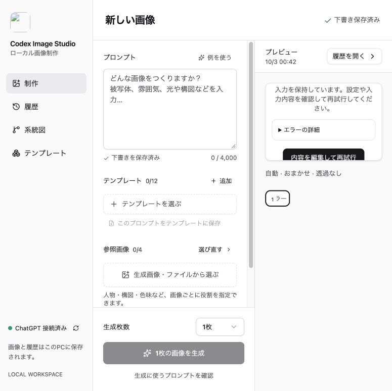
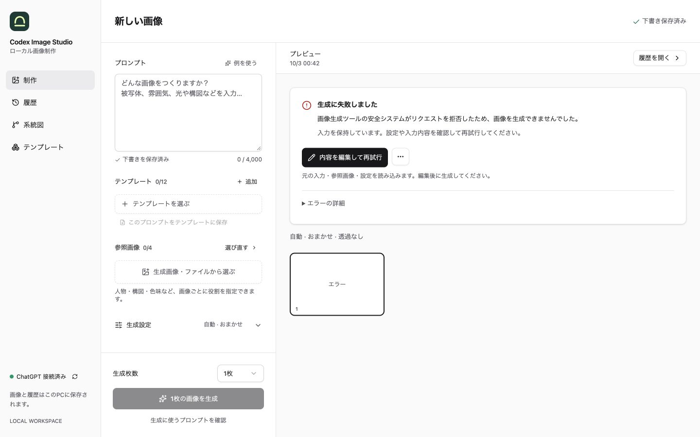
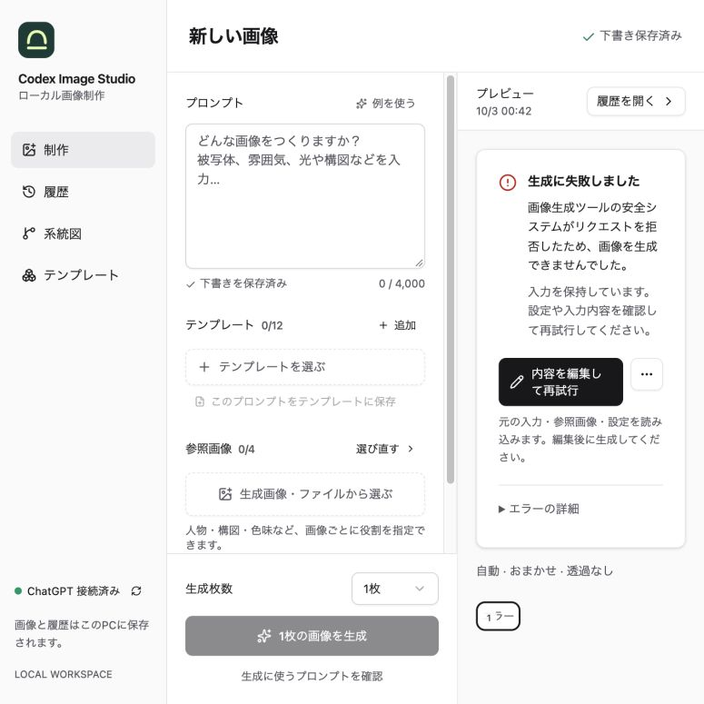
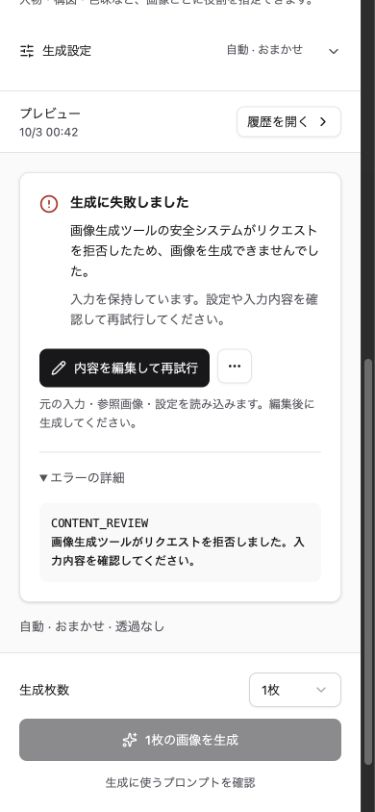
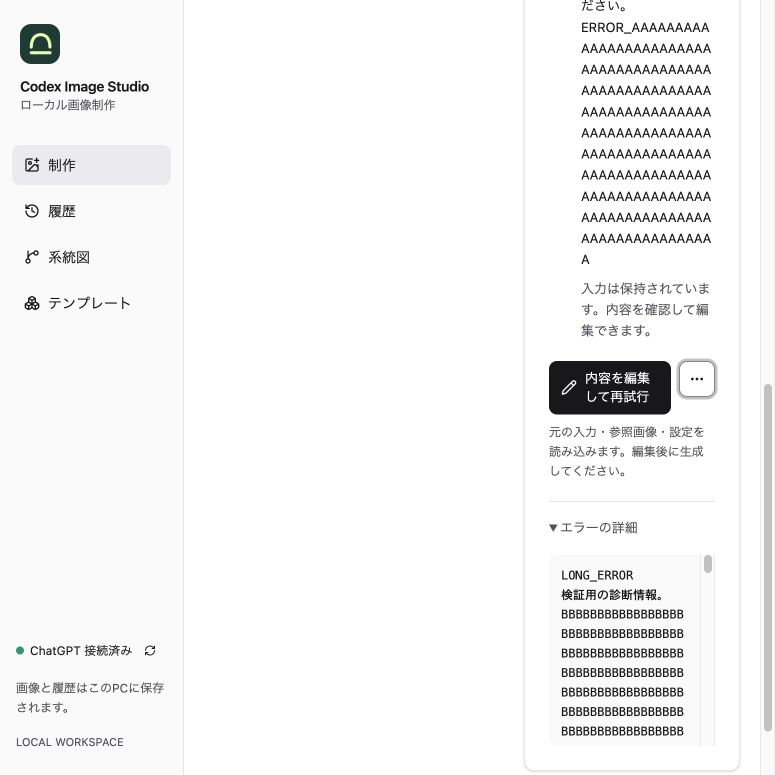
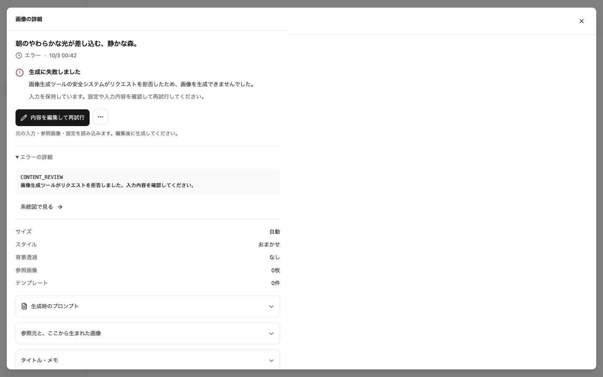

# 生成エラーUIの確認

2026-10-03、Codexのブラウザで制作画面と履歴の詳細画面を確認した。
表示専用のローカルプレビューに検証用のエラーを読み込み、実際の画像生成は行っていない。

## 変更前の問題

エラー文と対処案が中央揃えで広がり、同じ入力復元操作が二つ並んでいた。
画像のアスペクト比と `overflow-hidden` がエラー時にも適用され、775px幅では説明と操作が切れていた。

## 確認した操作

| 手順 | 結果 | 確認内容 |
| --- | --- | --- |
| 1. エラー表示 | 正常 | 説明・対処案を左揃えにまとめ、直下に編集ボタンとその他メニューを隣接して配置。775px幅でも両方が枠内に収まる。 |
| 2. 詳細の展開 | 正常 | エラーコードと診断を確認できる。390px幅で横方向のはみ出しなし。長い診断は192pxの領域内でスクロールできる。 |
| 3. 入力の復元 | 正常 | 編集ボタンで元の入力を読み込み、「元に戻す」で変更前へ戻れる。自動生成は始まらない。その他メニューも利用できる。 |
| 4. 履歴の詳細 | 正常 | 制作画面と共通の表示を使用し、その他メニューは一つだけ表示。 |

## 変更後

1440 × 900pxの制作画面。

775 × 775pxの制作画面。変更前と同じ幅で、説明・操作・詳細が切れずに表示される。

390 × 844pxのモバイル画面で詳細を開いた状態。

775px幅で長い説明・空白のない英数字・長い診断を表示し、Tabでメニューへ移動した状態。
説明に応じて枠が伸び、操作が枠内に収まることと、診断の折り返し・縦スクロールを確認した。

履歴の詳細でも同じ説明・操作・診断を表示する。

## 検証範囲

`npm run check` と `npm test` を最新のmain取り込み後に実行し、バックエンド176件・フロントエンド99件が成功した。
エラーがnull・文字列・構造化オブジェクトの場合、入力を保持すること、編集による生成の未実行、その他メニューからの削除確認への遷移をテストした。
ブラウザでは詳細展開、編集と取り消し、Tab移動、メニューの開閉、横方向のはみ出しと操作の枠内配置を確認した。
実際のChatGPT接続・画像生成と、スクリーンリーダーによる読み上げは今回の確認範囲に含まない。
